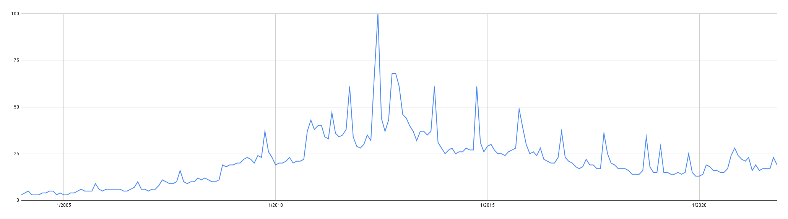
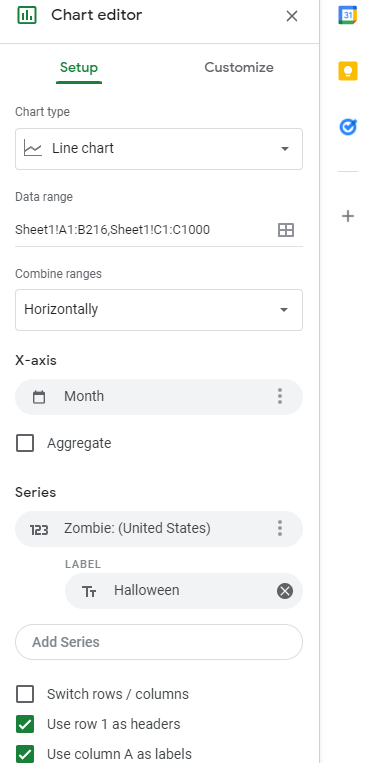

# Zombie Interest Analysis

## Have Zombies ever been more popular than during Halloween season? If so why?

<br>
This project was my short analysis of the google trends data set for zombies.
<br>

## 1. Data Organization

I used the data provided by Google Trends for the term 'zombie' from [here](https://trends.google.com/trends/explore?date=all&geo=US&q=zombie).
<br>
I downloaded the results from Google as a CSV and uploaded it to Google Sheets.
<br>
The data provided two columns, one for the month one for the numerical value google assigns for trends from 1-100.
<br>


|Month |	Zombie: (United States) |
-------|:---------------------------:|
|1/2004	| 3 |
|2/2004	| 4 |
|3/2004 |	5 | 

<br>
The data didnt need much cleaning at first since it had a simple layout and not that many data points.
<br>
I create a line chart in a second sheet with the data to get a more visual look at the data.
<br>



<br>
 I notice the spikes seem to be evenly spaced, so I suspect they may line up with October of each year for Halloween.
<br>
Going back to the first sheet, I decide to make a third column where I will mark the row with `H` for Halloween if the date matches correctly.
<br>
After some trial and error I decided to use the following for the whole column:

```
=IF(MONTH(A203)=10, "H", "")
```
This checked if the date in the corresping row was month=10(OCTOBER) the it woould update the current third column with `H` , otherwise it would leave it blank.

<br>
Now I have an entire third row telling me when a datapoint corresponds to Halloween.
<br>

|Month | Zombie: (United States) | Halloween|
|------|-------------------------|----------|
|9/2010 |	22 |	|
|10/2010	| 37 |	H |
|11/2010 | 43 |	|

<br>
I decided to add this third column as labels and  add them to their corresponding date to the chart to better understand everything:
<br>




## 2. Analysis

Now I move on to analysis. 
<br>
I was happy to see that for the most part I was correct, in that the higher consistent spikes did in fact line up with Halloween time.

<br>

Although, almost right in the middle was the largest data point and it did not line up with Halloween.

<br>

I got into the data and figure out the exact month and year this landed on.
```
June, 2012
```

To determine this was not a fluke and to determine the exact day in June that this occured, I returned to Google Trends and only displayed the result for May, June and July. 
<br>
June again came out on top with the highest trending, but now it also provided me with a day: `June 1st, 2012`.
<br>
I have no idea what could have caused this extreme outlier in the data, so I dig deeper.
<br>
I look into zombie movies released during `2012` but noothing significant matches.
<br>
I look into any zombie related TV shows, but again nothing matches.
<br>
My final stop was loking into zombie video games, but none of their releases matched the time frame.
<br>
I decide to look up just the date and zombies, `June 1st, 2012 zombie` and finally something interesting came up.
<br>
On that day the CDC emailed mutiple news networks with a statement that zombies were not real. 
<br>
well, we all know that but why did the CDC find the need to make a statement?
<br>
Once I read the news articles everything became clear. This was during a time when in 2012 some people in the world were using synthetic drugs and becoming very violent. Some of these cases the person began eating other people even, causing the news to call them zombie-like.
<br>
Now that I have my answer I decide to put it into an infographic. 
<br>

## 3. Presentation

<br>
For the infographic I used Adobe Spark. Both file types can be found above or clicked here:

[PDF](https://github.com/gman4774/zombies_info/blob/main/zombies_info_pdf.pdf) 

 and <br>

[PNG](https://github.com/gman4774/zombies_info/blob/main/zombies_info_png.png) 

<br>
